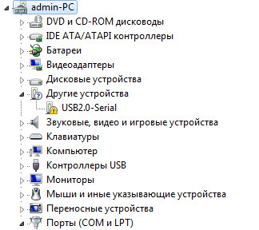
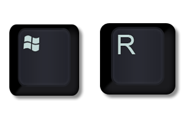
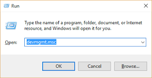
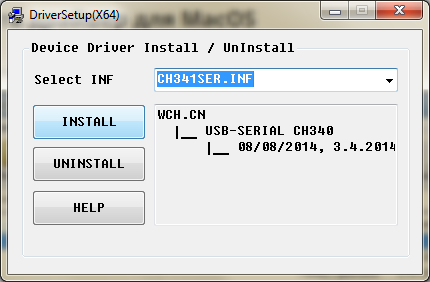
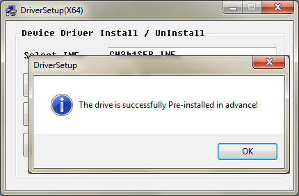
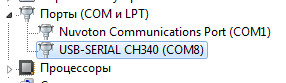

**Опис CH340G**
=========

* Повіноціний перехідник USB – COM-порт (RS232) з рівнями TTL/CMOS та каналами: TxD, RxD, DTR, CTS
* Підтримка драйверів WindowsXP , Windows7 , Windows8, Mac OS,  Linux
* Підтримка USB 2.0
* Швидкість передачі даних від 50bps до 2Mbps
* Підтримка інтерфейсів RS232, RS485, RS422
* Програмне забезпечення повністю сумісне з CH341
* Підтримка живлення 5v та 3,3v

## Встановлення драйвера CH340G

Після підключення нашого пристрою, у "Диспетчер пристроїв" ми побачимо що він визначається як `USB 2.0 SERIAL` і `Windows 7` не може самостійно встановити драйвер для нього.

> Щоб відкрити "Диспетчер пристроїв", для Windows, натисніть комбінацію клавіш `Win+R` та у вікні, що з'явиться, надрукуйте: `devmgmt.msc` і підтвердіть.

> 
> 

Для початку завантажимо драйвер [CH340](https://sparks.gogo.co.nz/assets/_site_/downloads/CH34x_Install_Windows_v3_4.zip) для Windows.
Та встановимо його:

Після повідомлення про успішне встановлення драйвера:

диспетчер пристроїв оновить інформацію про пристрої і у вікні "Порты COM и LPT" з'явиться наш підключений пристрій:

