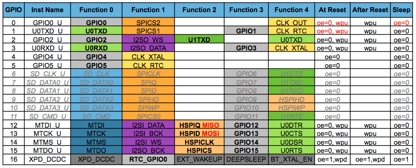

**Встановлення програмного забезпечення для роботи з контролером**

1. Завантажте та встановіть Arduino IDE з *офіційного веб-сайту*.

2. Запустіть Arduino IDE та відкрийте вікно налаштувань.

3. Додайте наступну URL стрічку в поле «Менеджер додаткових плат».
   http://arduino.esp8266.com/stable/package_esp8266com_index.json

|image0|

1. Відкрийте **Менеджер плат** з меню **Інструменти> Плата:** та
   знайдіть платформу esp8266.

2. Виберіть найактуальнішу версію у спадному списку (на момент написання
   цієї документації це є версія 2.4.0).

3. Натисніть кнопку "Встановити".

4. Не забудьте обрати вашу конфігурацію плати ESP8266, за допомогою меню
   **Інструменти> Плата:** , після встановлення.

P.S. Також, за бажанням, ви можете використати тестовий пакунок
менеджера плат:
http://arduino.esp8266.com/staging/package\_esp8266com\_index.json.  Він
може містити деякі нові функції, але в той же час деякі речі можуть
неправильно працювати.

Список посилань:
http://arduino-esp8266.readthedocs.io/en/2.4.0/installing.html

**Синтаксис**

**Digital IO**

Існують спрощені функції налаштування – pinMode, зчитування стану –
digitalRead та запису – digitalWrite. Номери цифрових входів/виходів в
Arduino безпосередньо відповідають номерам GPIO ESP8266, так що щоб
зчитати стан GPIO2 треба викликати функцію – digitalRead(2).

Цифрові контакти 0-15 може бути налаштовані на приймання – INPUT,
виведення – OUTPUT або прийом з підтяжкою до логічної одиниці –
INPUT\_PULLUP . GPIO16 не має налаштування – INPUT\_PULLUP , але
натомість він має прийом з підтяжкою до логічної нуля –
INPUT\_PULLDOWN\_16. По замовчанню всі GPIO налаштовані як – INPUT, але
щоб розширити flash пам'ять більшість модулів ESP містить додаткову
мікросхему пам’яті яка підключається до GPIO 6,7,8,9,10,11 і тому їх не
можна використовувати за звичним призначенням, щоб мати змогу
користуватися додатковою пам’яттю, але ви можете ще налаштувати на цих
контактах урізаний по часу SPI інтерфейс, і пам’ятайте – не вірне
застосування може призвести до краху програми адже ці контакти
відповідають за пам'ять що використовується для запису самої прошивки
(контакти 9,10 можуть бути задіяні в якості IO, якщо флеш-чіп працює в
режимі DIO (на відміну від QIO, який за замовчуванням один).

Насправді це далеко не всі налаштування GPIO, так наприклад існують
спеціальні налаштування для конкретних виводів, щоб налаштувати апаратні
інтерфейси обміну даних таких як SPI, I2C абощо. Ці функції, як правило,
активується відповідною бібліотекою. 

Функції контактів:

|image1|

Переривання контактів задається за допомогою функції – attachInterrupt ,
а відключається за допомогою – detachInterrupt і можуть бути налаштовані
на всіх GPIO окрім GPIO16. Підтримуються такі типи переривання: CHANGE,
 RISING,  FALLING, так щоб налаштувати переривання по зміні рівня з 1 в
0 для GPIO2 треба викликати функцію – attachInterrupt(GPIO2,callback,
FALLING); , де callback – це функція що буде викликана в результаті
переривання.

На зображеннях нижче показана назви та призначення всіх контактів
популярних модулів ESP-12 та ESP-1 відповідно.

|image2|

    |image3|

    Також ви можете роздивитися назви та призначення всіх контактів на
    самому чіпі.

    |image4|

    POWER – живлення I/O – контакти входу/виходу інформації

    ADC – АЦП CONTROL – контакти для регулювання режимів

    SP.FUN – спец функції COMM. INT – функції різних інтерфейсів

    PWM – ШІМ PIN NUM – номер ніжки

    І звичайно зображення плати NodeMCU

    |image5|

Як бачимо на картинці є застереження:

-  Типове значення струму від GPIO 6mA (Max. 12mA)

-  Для режиму сну з’єднайте GPIO16 та EXT\_RSTB. Щоб модуль прокинувся
   треба притягнути GPIO16 до лог. нуля, або перезавантажити модуль

-  Щоб плата прокинулася, перезавантажилася тримайте значення GPIO15
   лог. нуль та притягніть GPIO2 до лог. одиниці. (інколи так може вийти
   випадково тому слідкуйте за з’єднаннями)

**Analog input**

ESP8266 має лише один канал 10-розрядного АЦП. Він може бути
використаний або для зчитування напруги з контакту АЦП, або для
визначення напруги живлення модуля (VCC), що інколи може бути корисним.

Для зчитування зовнішньої напруги , що подається на АЦП, використовують
функцію – analogRead(A0), що повертає значення 0-1023. Діапазон вхідної
напруги 0 - 1.0V, але можна подавати на вхід напругу вище, рекомендовано
до напруги живлення (VCC – 3.3V).

Для читання VCC напруги, використовується функція – ESP.getVcc() , при
цьому ADC контакт повинен бути не підключеним! Крім того, обов’язково
повинен бути додана команда налаштування ADC – ADC\_MODE(ADC\_VCC); що
повинна бути додана до програми на початок програми, перед всіми
функціями, наприклад, відразу після підключення всіх бібліотек
(#include).

**Analog output or PWM (*pulse-width modulation*)**

| Всі GPIO підтримують ШІМ, тому щоб застосувати його вам лише потрібно
  викликати функцію – analogWrite(pin, value) ,де pin – це GPIO що
  підтримує PWM ,а value – це значення заповненості (duty cycle) періоду
  і регулюється від 0 до PWMRANGE (по замовчуванням 1023) відповідно 0%
  та 100% заповненості.
| Також за допомогою функції - analogWriteFreq(frequency) ви можете
  змінювати частоту (період) ШІМ, що по замовчуванню рівна 1 кГц, а за
  допомогою - analogWriteRange(range) ви можете змінювати PWMRANGE.

|image6|

Timing and delays
-----------------

Функції millis()і micros()повертають кількість мілісекунд і мікросекунд відповідно, що минули після скидання.
-------------------------------------------------------------------------------------------------------------

Функція delay(ms)призупиняє роботу основної програми на заданий час в
мілісекундах і резервує цей час для обробки завдань WiFi та TCP/IP.
Функція – delayMicroseconds(us) призначена для паузи на задане число
мікросекунд

Пам'ятайте , що є багато задач, що повинні забезпечувати стабільну
роботу Wi-Fi, і для них потрібно періодично виділяти час роботи. WiFi і
TCP/IP бібліотека отримують можливість обробляти будь-які очікувані
події кожен раз , коли функція loop()завершується, або коли
викликається функція delay. Якщо у вас в програмі є будь яке оброблення,
що займає багато часу (> 50 мс) без виклику delay, ви можете розглянути
варіант спеціально додати виклик функції delay для підтримки нормального
виконання стеку Wi-Fi.

Існує також функція yield(), яка еквівалентна delay(0). Функція
 delayMicroseconds не поступається часом виконання іншим завданням, тому
використання її для затримки більш ніж на 20 мілісекунд , не
рекомендується.

**Serial**

Об'єкт Serial працює так само, як і з Arduino. Крім апаратного FIFO (128
байт для передачі –TX та прийому – RX ), Serial має додаткові 256-байт
для TX та RX в буфері. Передача, і прийом даних виконується по
перериваннях, прозоро до вашого скетчу. Функції запису та читання
блокують виконання програми лише тоді, коли FIFO – заповнений, або буфер
– пустий. Зверніть увагу, що довжину додаткового 256-бітового буфера
можна налаштувати.

Serial використовує UART0, який зіставляється з пінами GPIO1 (TX) та
GPIO3 (RX). Ці контакти можуть бути переназначені на GPIO15 (TX) і
GPIO13 (RX), викликом функції – Serial.swap() після Serial.begin().
Повторний виклик – Serial.swap() знову повертає UART0 назад.

Також, паралельно можна запустити Serial1 , що використовує UART1 та
зіставляється лише з GPIO2 (TX), адже пін що відповідає за отримання
даних (RX) належить контактній групі контактів для підключення flesh
чіпу. Отже UART1 не може використовуватися для отримання даних. Для
використання Serial1, викличте функцію – Serial1.begin(baudrate), де
baudrate – це швидкість передачі в бод (baud).

Якщо Serial1 не використовується, а Serial не був перекинутий, то TX для
UART0 може бути зіставлений з GPIO2 викликом команди Serial.set\_tx(2)
після Serial.begin або безпосередньо Serial.begin(Baud, Config, Mode,
2).

За замовчанням діагностична інформація від бібліотек WiFi вимикається
після виклику Serial.begin(). Для моніторингу налагоджувальної
інформації на UART0 використайте – Serial.setDebugOutput(true). Щоб
спрямувати вивід – інформації на Serial1 використайте –
Serial1.setDebugOutput(true).

Вам також слід використовувати – Serial.setDebugOutput(true), щоб
активувати стандартну функцію виводу – printf().

Метод –Serial.setRxBufferSize(size\_t size) дозволяє задати розмір
приймального буфера. Значення за замовчуванням - 256.

Serial та Serial1 підтримують 5, 6, 7, 8 біт даних, odd (O), even (E),
no (**N**) режими парності, 1 або 2 стоп біта. Для вибору потрібного
режиму викличте –Serial.begin(baudrate, SERIAL\_8N1); або
Serial.begin(baudrate, SERIAL\_6E2); і т.д.

Новий метод був реалізований як для Serial, так і для Serial1, щоб
отримати поточну настройку швидкості передачі. Щоб отримати поточну
швидкість передачі, викличте – Serial.baudRate(), Serial1.baudRate (),
які повернуть значення типу int з поточною швидкістю. Наприклад:

**//** Set Baud rate to 57600

**//** Установити бод швидкість 57600

Serial\ **.**\ begin(57600);

**//** Get current baud rate

**//** Отримати поточну бод швидкість

int br **=** Serial\ **.**\ baudRate();

**//** Will print "Serial is 57600 bps"

**//** Надрукує "Serial is 57600 bps"

Serial\ **.**\ printf("Serial is %d bps", br);

P.S. Serialі Serial1об'єкти є екземплярами HardwareSerial класу.

Описаний вище метод, також підтримується офіційною ESP8266 *Software
Serial* бібліотекою.

Зверніть увагу , що ця реалізація дійсна **тільки для плат на базі
ESP8266** , і не буде працювати з іншими платами Arduino.

Існують багато різноманітних функцій для роботи з типом String, і об’єкт
– Serial співпрацює з ними, тому їх застосування буде доречним, а сам
Serial є типом *Stream*.

Preprocessor Directives and Macros
==================================

Директиви це команди для компілятора, вони не записуються в мікроконтролер, а задають налаштування для компілятора, за допомогою них можна вирішити проблему сумісності програми для різних контролерів (архітектур), як наприклад в нашому випадку – Arduino використовують ARM архітектуру, а ESP має архітектуру розроблену компанією Espressif. Також існують інші корисні застосування про які ви можете почитати самостійно…
Розглянемо найбільш вживані директиви в даному курсі:
----------------------------------------------------------------------------------------------------------------------------------------------------------------------------------------------------------------------------------------------------------------------------------------------------------------------------------------------------------------------------------------------------------------------------------

Директива #define створює макрос, який представляє собою асоціацію звичайного або параметризованого ідентифікатора з рядком токена. Після визначення макросу компілятор може підставити рядок токена для кожного виявленого ідентифікатора в вихідному файлі. Наприклад:
------------------------------------------------------------------------------------------------------------------------------------------------------------------------------------------------------------------------------------------------------------------------

#define TEN 10 – автоматично підставляє значення «10» в програму де буде вказана змінна TEN
-------------------------------------------------------------------------------------------

#define multiply(a , b) (a \* b) – макрос що підставляє дію “(f1\* f2)” замість функції multiply(f1 , f2)
---------------------------------------------------------------------------------------------------------

#define CHECK2(x, ...) if ((x)) { printf(\_\_VA\_ARGS\_\_); } –
автоматично передає всі аргументи типу ‘char const \*’ на місце
\_\_VA\_ARGS\_\_ . Додатково можна почитати
`*тут* <https://ru.wikipedia.org/wiki/%D0%92%D0%B0%D1%80%D0%B8%D0%B0%D1%82%D0%B8%D0%B2%D0%BD%D1%8B%D0%B9_%D0%BC%D0%B0%D0%BA%D1%80%D0%BE%D1%81>`__
і `*тут* <https://msdn.microsoft.com/uk-ua/library/ms177415.aspx>`__.

Директива #if разом з директивами #elif, #else та #endif управляє компонуванням частин вихідного файлу. Якщо вказаний вираз (після #if) має не нульове (true) значення, компілятор прийме до уваги все від директиви #if до директив – #elif, #else та #endif , при нульовому значені (false) проігнорує. Компанується вони по наступному – if, elif, else, endif , з яких #elif та #else не обов’язкові, також #if може бути видозмінена на #ifdef (якщо визначений ідентифікатор), або #ifndef (якщо не визначений ідентифікатор).
------------------------------------------------------------------------------------------------------------------------------------------------------------------------------------------------------------------------------------------------------------------------------------------------------------------------------------------------------------------------------------------------------------------------------------------------------------------------------------------------------------------------------------

Більш детально розписано `*тут* <https://msdn.microsoft.com/uk-ua/library/ew2hz0yd.aspx>`__.
--------------------------------------------------------------------------------------------

Про додаткове оперування токеном можна почитати `*тут* <https://msdn.microsoft.com/uk-ua/library/09dwwt6y.aspx>`__.
Приклад застосування:
-------------------------------------------------------------------------------------------------------------------

#define DEBUG\_var(token) { DEBUG\_print( #token " = "); \\
DEBUG\_println(token); }

, де знак « \\ » це сповіщення компілятора про перехід на наступний рядок, без нього перехід буде помилкою
----------------------------------------------------------------------------------------------------------

Приклад 2
---------

// Macros function

#define RelayTrigger(); \\

{ \\

if (open\_door == false) \\

digitalWrite(RELAY, HIGH); \\

Beep(50, 100 , 2); delay(500); \\

digitalWrite(RELAY, LOW); \\

}

LifeHack використання макросів для зручної роботи з Serial
----------------------------------------------------------

#define Project\_DEBUG // якщо закоментувати цей рядок то вимкнеться
весь DEBUG\_Serial

#ifdef Project\_DEBUG

#define DEBUG\_Serial Serial

#define DEBUG\_print(...) DEBUG\_Serial.print(\_\_VA\_ARGS\_\_)

#define DEBUG\_println(...) DEBUG\_Serial.println(\_\_VA\_ARGS\_\_)

#define DEBUG\_begin(...) DEBUG\_Serial.begin(\_\_VA\_ARGS\_\_)

#define DEBUG\_printf(...) DEBUG\_Serial.printf(\_\_VA\_ARGS\_\_)

#define DEBUG\_flush(...) DEBUG\_Serial.flush(\_\_VA\_ARGS\_\_)

#define DEBUG\_var(token) { DEBUG\_print( #token " = ");
DEBUG\_println(token); } // Дуже зручний макрос для дебагу змінних будь
якого типу, він автоматично підписує всі введені в нього змінні та
виводить їх значення через знак рівності.

#else

#define DEBUG\_Serial

#define DEBUG\_print(...)

#define DEBUG\_println(...)

#define DEBUG\_begin(...)

#define DEBUG\_printf(...)

#define DEBUG\_flush(...)

#define DEBUG\_var(token)

#endif

Список посилань: `*https://msdn.microsoft.com/uk-ua/library/b0084kay.aspx* <https://msdn.microsoft.com/uk-ua/library/b0084kay.aspx>`__
--------------------------------------------------------------------------------------------------------------------------------------

*https://msdn.microsoft.com/en-us/library/503x3e3s.aspx*
--------------------------------------------------------

*https://msdn.microsoft.com/uk-ua/library/09dwwt6y.aspx*
--------------------------------------------------------

*https://msdn.microsoft.com/uk-ua/library/ms177415.aspx*
--------------------------------------------------------

*https://msdn.microsoft.com/uk-ua/library/ew2hz0yd.aspx*
--------------------------------------------------------

Progmem
-------

Макрос PROGMEM працює точно так же, як в Arduino, поміщаючи лише *read
only* данні і строкові константи (літерали) у флеш пам'ять, випускаючи
HEAP. Важлива відмінність полягає в тому, що в ESP8266 однакові літерали
не зберігається в одному місці, тому використання строкових констант
всередині конструкцій F ("") та/або PSTR ("") призводить до витрачання
флеш пам'яті при кожному виклику цих функцій. Ви повинні самостійно
управляти однаковими рядками для економічного витрачання місця у флеш
пам'яті.

Існує ще один допоміжний макрос, який полегшує передачу рядків const
PROGMEM методам, що приймають \_\_FlashStringHelper під назвою FPSTR().
Використання цього допоможе спростити розподіл рядків. Не об'єднуючі
рядки...

String response1;

response1 **+=** F("http:");

**...**

String response2;

response2 **+=** F("http:");

використовуючи FPSTR код став би ...

const char HTTP[] PROGMEM **=** "http:";

**...**

{

String response1;

response1 **+=** FPSTR(HTTP);

**...**

String response2;

response2 **+=** FPSTR(HTTP);

}

.. |image0| image:: media/image1.png
   :width: 6.49653in
   :height: 5.77775in

.. |image2| image:: media/image3.png
   :width: 6.68750in
   :height: 5.18750in
.. |image3| image:: media/image4.png
   :width: 4.65625in
   :height: 3.75000in
.. |image4| image:: media/image5.png
   :width: 6.37500in
   :height: 8.25000in
.. |image5| image:: media/image6.png
   :width: 6.68750in
   :height: 5.16667in
.. |image6| image:: media/image7.png
   :width: 5.25000in
   :height: 2.56250in
