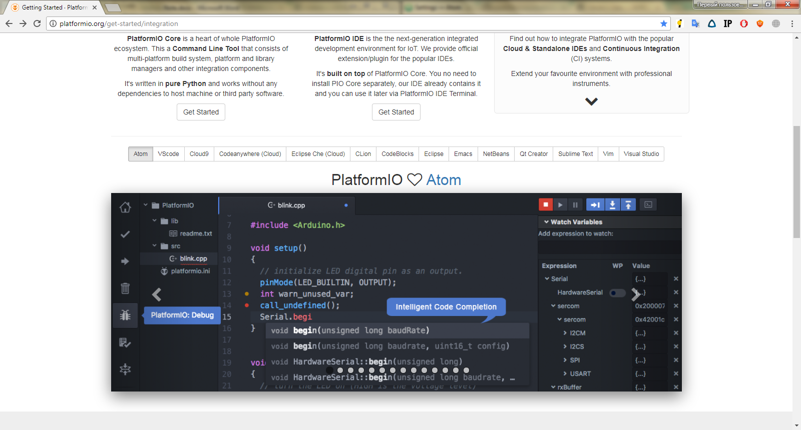
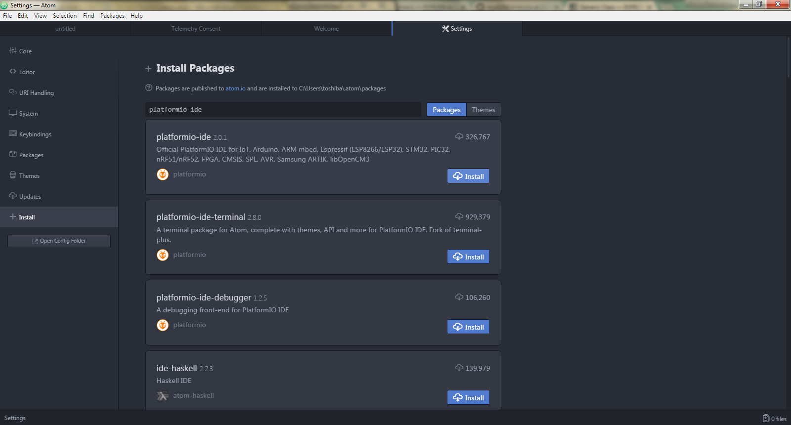
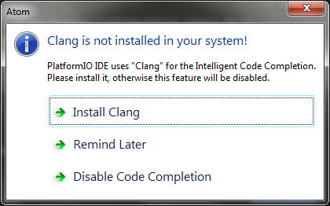
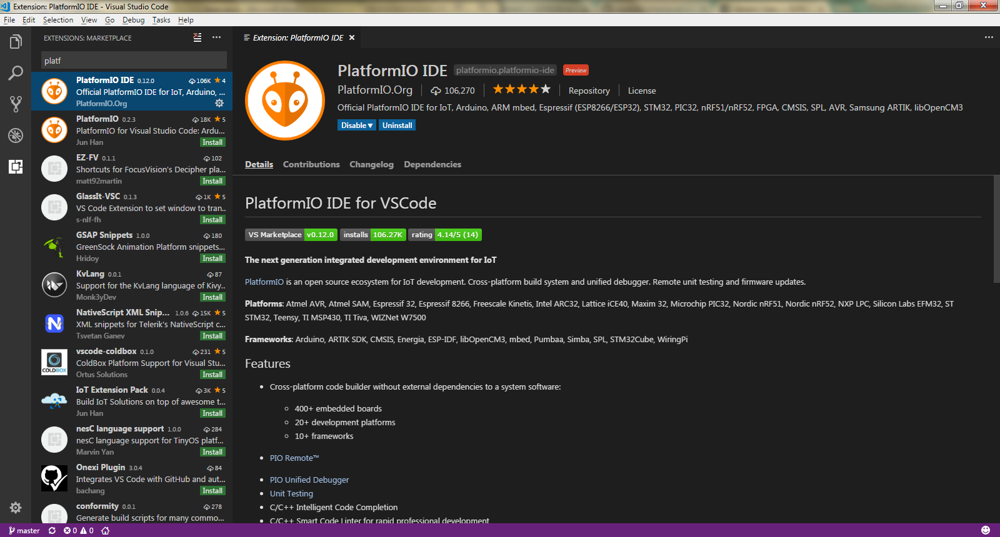
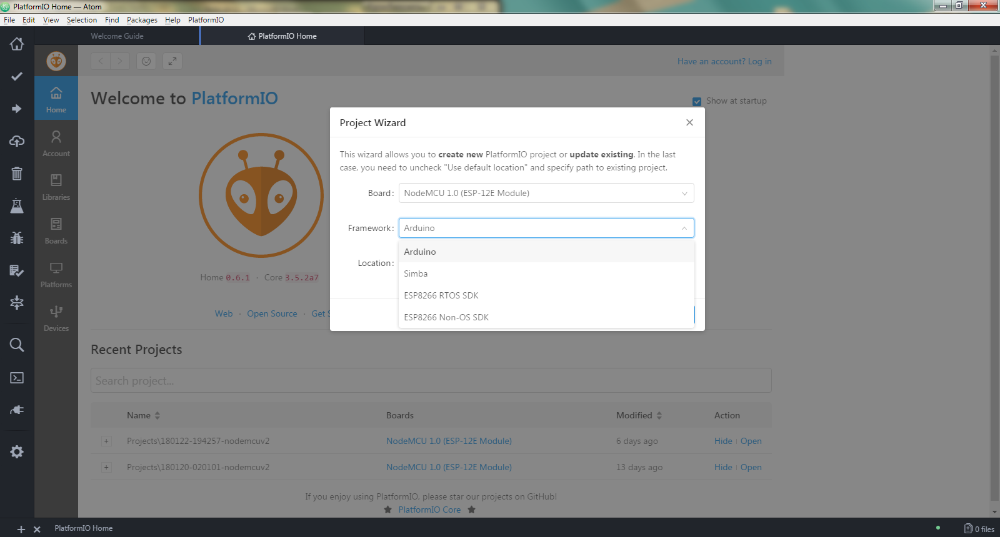

| Покращимо собі умови з новим IDE, і з робимо це максимально
  «безболісно». Спочатку відвідаємо сайт
  `*PlatformIO* <http://platformio.org/get-started/integration>`__ та
  оберемо для себе IDE в яку можна інтегрувати даний додаток. Виглядає
  це ось так:
| |image0|
| Далі обираємо для себе знайому або бажану IDE, і переходимо за
  посиланням на `*англомовну
  інструкцію* <http://docs.platformio.org/en/latest/ide.html>`__, вона
  інтуїтивно зрозуміла тому проблем бути не повинно…
| В даному курсі ми оберемо `*Atom IDE* <https://atom.io/>`__, через її
  переваги з графічним інтерфейсом для наших цілей. Але також розглянемо
  приклад роботи з консоллю адже це універсальне рішення.
| Отже завантаживши та встановивши Atom IDE (або інше) заходимо в
  *>File>Settings* , після чого з’являється панель налаштування на якій
  є кнопка *Install*. Шукаємо за запитом platformio-ide додаток і
  встановлюємо його.

|image1|

| В процесі установки Atom запросить встановити
  `*Clang* <http://docs.platformio.org/en/latest/ide/atom.html#ii-clang-for-intelligent-code-completion>`__,
  тож підкоряємося (ну а VS Code потребує `*Python
  2.7* <https://www.python.org/downloads/>`__)
| |image2|

| |image3|
| Після встановлення перезавантажуємо IDE та створюємо новий проект у
  вікні PlatformIO. Обираємо свою плату та звичний нам Framework –
  Arduino.
| |image4|
| Бачимо нове меню проекту зліва та заходимо в теку src де вже є
  main.cpp файл, а не main.ino (при перенесені проекту з Arduino IDE
  треба змінити розширення на .cpp). Також бачимо відмінність нового
  проекту в цьому IDE від Arduino, що тут обов’язково повинна бути
  підключена бібліотека :

#include ***<Arduino.h>***

| Це також треба враховувати при перенесені проекту. Тека (каталог,
  директорія) lib призначена для зберігання не стандартних бібліотек які
  необхідні для проекту.
| Спробуємо написати програму Blink.cpp і завантажити її через це IDE.
  Для цього в Atom можна скористатися графічним інтерфейсом і навіть
  налаштувати COM-port, але в інших IDE можуть бути відсутні деякі
  функції в графічному інтерфейсі, тому `*вчимося користуватися
  консоллю* <http://docs.platformio.org/en/latest/userguide/index.html>`__.

