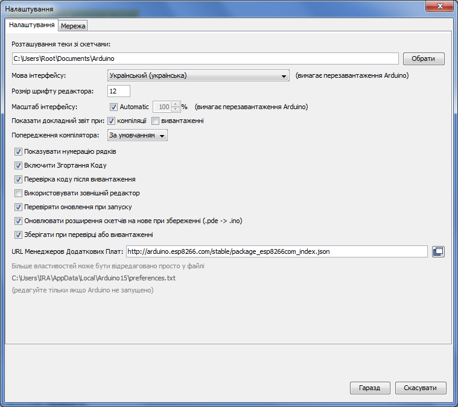
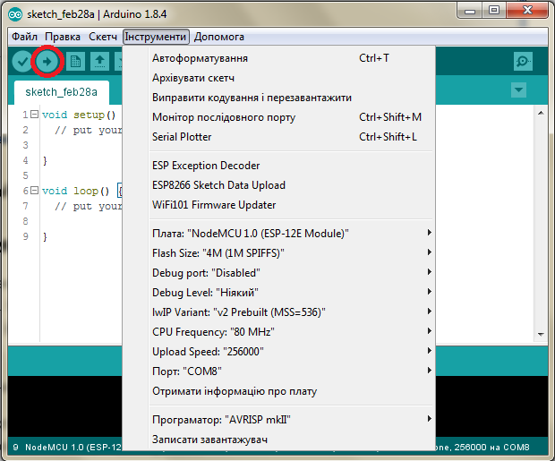
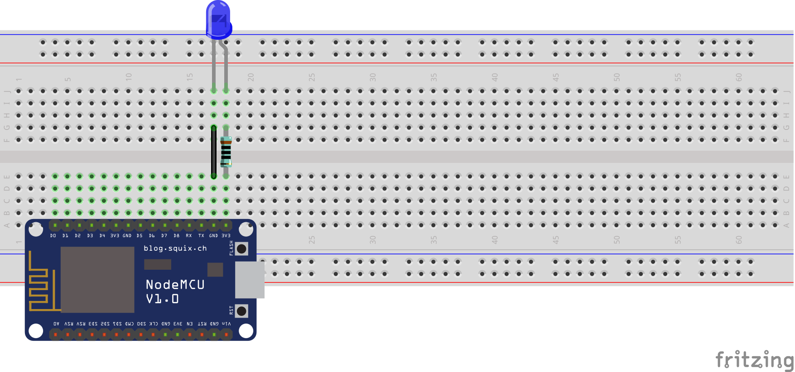
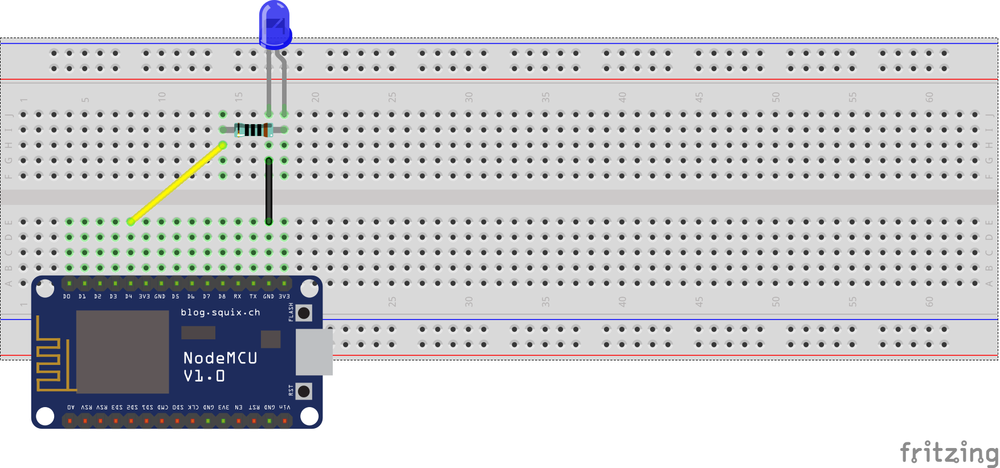
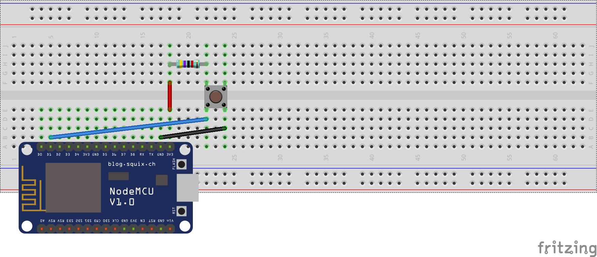
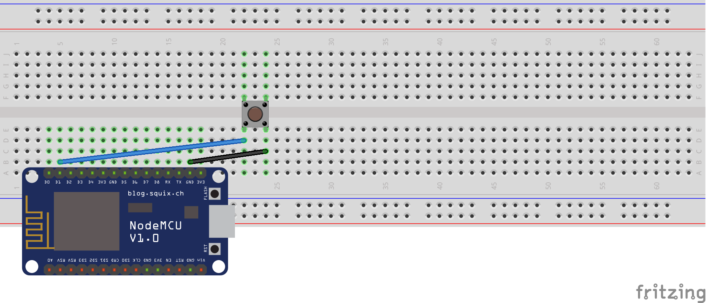
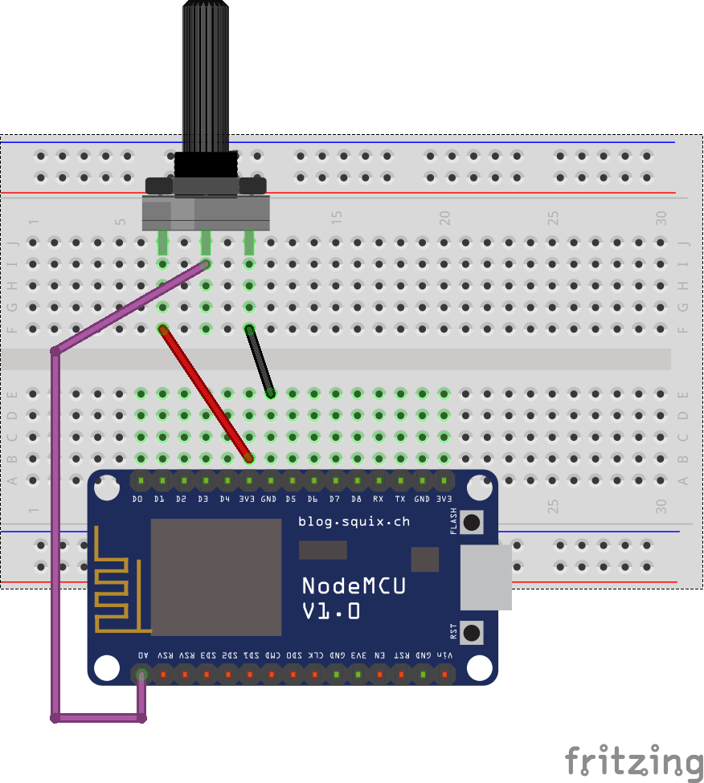
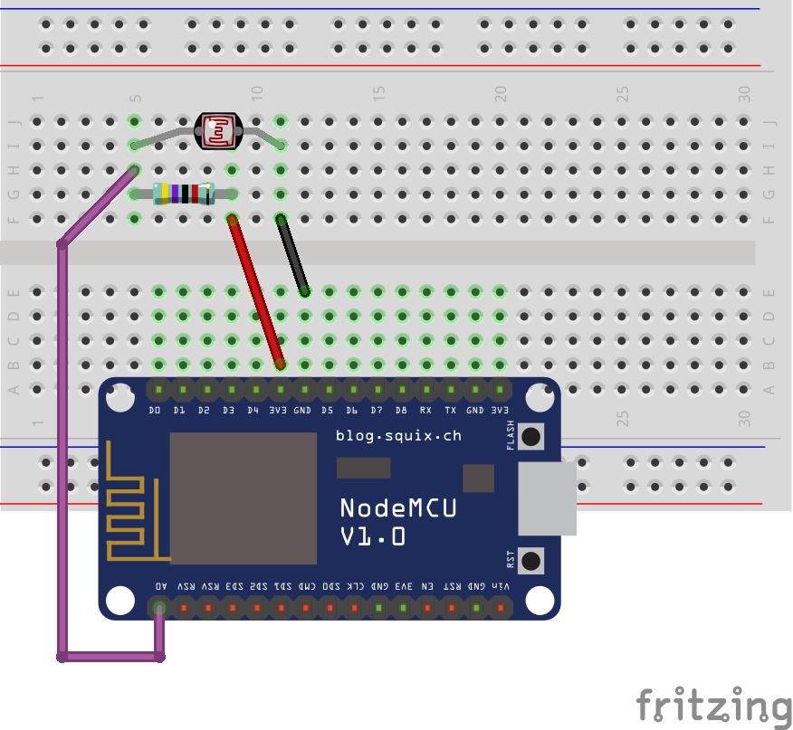
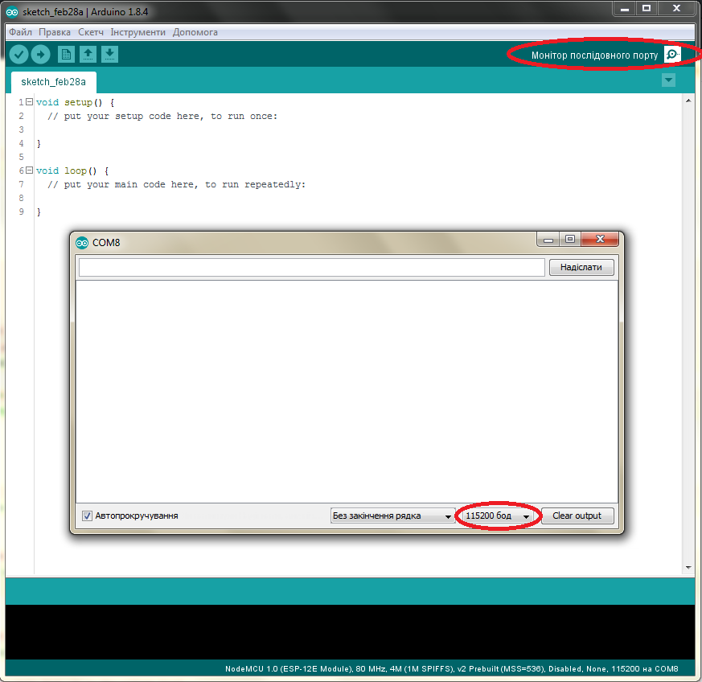

**Урок 1.  Знайомство з `Wi-Fi` модулем `ESP8266` та `Arduino IDE`. Керування портами вводу-виводу**
=================


Зміст
-------

   * [`Wi-Fi` модуль `ESP8266`](#wi-fi-модуль-esp8266)
      * [Карта виводів плати розробника `"NodeMCU"`](#Карта-виводів-плати-розробника-nodemcu)
      * [Функції контактів](#Функції-контактів)
   * [Встановлення `Arduino IDE`](#Встановлення-arduino-ide-та-його-налаштування-для-роботи-з-esp8266)
      * [Підключення плати `"NodeMCU"` до комп'ютера](#Підключення-плати-nodemcu-до-компютера)
      * [Структура програм в `ARDUINO IDE`](#Структура-програм-в-arduino-ide) 
      * [Перший скетч "`Blink`"](#Перший-скетч-blink)   
   * [Навчальні приклади для програмування `ESP8266`](#Навчальні-приклади-для-програмування-esp8266)
      * [Керування портами вводу-виводу](#Керування-портами-вводу-виводу)
      * [Переривання на портах вводу-виводу](#Переривання-на-портах-вводу-виводу)
      * [Налаштування та використання ШІМ (`PWM`)](#Налаштування-та-використання-ШІМ-pwm)
      * [Аналогово-цифрове перетворення](#Аналогово-цифрове-перетворення)
      * [Передавання даних на комп'ютер](#Передавання-даних-на-компютер)
   * [Завдання](#tests)
   * [Перелік посилань](#Перелік-посилань)

***


## `Wi-Fi` модуль `ESP8266`

У курсі ми будемо використовувати плату для розробки `"NodeMCU"`, що забезпечує живлилення та можливість комунікації `ESP8266` з комп'ютером через інтерфейс USB. Під час роботи з `"NodeMCU"` його програмування відбувається аналогічно `"Arduino"`. 


 

Приведена плата розробника з  модулем `ESP8266` є однією з найдешевших на ринку і продається за ціною близько $4.


У складі `NodeMCU devkit` є перетворювач протоколів UART-USB  `CP2102` або `CH340`. Плата також має стабілізатор напруги на 3.3 вольта `NCP1117`, синій світлодіод на `GPIO16` та подільник напруги 220к / 100к Ом на вході штирі АЦП.

>Якщо плату не вдається запрограмувати можна спробувати скористатися _RESET_, утримуючи  кнопки FLASH + RST, потім відпустити FLASH, а за ним відпустити RST, тим самиам перезавантажуючи `CP2102` (`CH340`).


### Карта виводів плати розробника `"NodeMCU"`

Оскільки номери виводів на платі не відповідають номерам виводів `GPIO` `ESP8266`, то для полегшення використання плати розробника пропонується виконати перевизначення виводів через константи, що ідентичні надписам на платі розробника.

```c
static const uint8_t SDA = 4;
static const uint8_t SCL = 5;

static const uint8_t LED_BUILTIN = 16;
static const uint8_t BUILTIN_LED = 16;

static const uint8_t D0   = 16;
static const uint8_t D1   = 5;
static const uint8_t D2   = 4;
static const uint8_t D3   = 0;
static const uint8_t D4   = 2;
static const uint8_t D5   = 14;
static const uint8_t D6   = 12;
static const uint8_t D7   = 13;
static const uint8_t D8   = 15;
static const uint8_t D9   = 3;
static const uint8_t D10  = 1;
```

Тобто, якщо ви хочете використати вивід D5 на `'NodeMCU'` слід використовувати константу `D5`. В той час як "реальний" вивід на `ESP8266` буде використаний `GPIO 14`.

### Функції контактів

 


			

Позначення | Призначення
--- | --- 
POWER   | Живлення 
ADC | АЦП 
SP.FUN  | Спец. функції 
PWM   | ШІМ (широтно-імпульсна модуляція)
I/O   | Контакти входу/виходу інформації 
CONTROL | Контакти для регулювання режимів 
COMM. INT  | Функції різних інтерфейсів  
PIN NUM    | Номер ніжки 

>Зверніть увагу на застереження.
>-	Типове значення струму від `GPIO` 6 мА (max. 12 мА)
>-	Для переведення модуля в енергозберігаючий режим необхідно з’єднати `GPIO16` та `EXT_RSTB` між собою. Для виходу з енергозбергігаючого режиму треба встановити на `GPIO16` лог. нуль, або перезавантажити модуль.
>-	Для перезавантаження модуля або виходу з енергозбергігаючого режиму необхідно встановити на `GPIO15`  лог. нуль, а на`GPIO2`  лог. одиницю. (Необхідно слідкувати, шоб такі умови не виникнули випадково!)


## Встановлення `Arduino IDE` та його налаштування для роботи з `ESP8266`


1.	Завантажте та встановіть `Arduino IDE` з офіційного [веб-сайту](https://www.arduino.cc/en/Main/Software).
1.	Запустіть `Arduino IDE` та відкрийте вікно налаштувань.
1.	Додайте наступну URL стрічку в поле «_Менеджер додаткових плат_». http://arduino.esp8266.com/stable/package_esp8266com_index.json
 
1.	Відкрийте "_Менеджер плат_" в меню _Інструменти_ > _Плата_: та знайдіть платформу `ESP8266`.
1.	Виберіть найактуальнішу версію успадному списку (на момент написання цієї документації це є версія `2.4.1`).
1.	Натисніть кнопку "_Встановити_".
1.	Незабудьте обрати вашу конфігурацію плати `ESP8266`, за допомогою меню _Інструменти_ > _Плата_: після встановлення.

> P.S. Також, за бажанням, ви можете використати тестовий пакунок менеджера плат: http://arduino.esp8266.com/staging/package_esp8266com_index.json. 
Він може містити деякі нові функції, але в той же час деякі речі можуть неправильно працювати.

### Підключення плати "NodeMCU" до комп'ютера

Як зазначалося вище плата містить мікросхему `CP2102` (`CH340`) через яку виконується спілкування модуля з USB портом вашого комп'ютера. Тому для роботи з контролером необхідний драйвер мікросхеми, у випадку з `CP2102` `Windows 7` (або новіша версія), автоматично його встановлює, а з `CH340` треба це робити вручну. 

[Інструкція для перевірики і встановленння драйверу
](Install_CH340.md)


### Структура програм в `ARDUINO IDE`

```c
void setup() {
     // функція налаштувань мікроконтролера
     // виконується лише один раз, після вмикання живленя або скидання
}

void loop() {
     // функція для виконання основного алгоритму 
     // виконується циклічно безкінечно разів
}
```

### Перший скетч "Blink"
   
Зазвичай уроки програмування розпочинають з прикладу "Hello World!", але в сфері мікроконтролерів існує власний аналог "Blink" який моргає світлодідом.   
    
> Зверніть увагу, що даний приклад перевизначає константу `LED_BUILTIN`, адже наша плата містить лише один вбудований світлодіод на `GPIO 2`
   
   
   
   ``` c
   #define LED_BUILTIN 2               // Переприсвоєння константи LED_BUILTIN значення ніжки GPIO 2
    
   void setup() {
     pinMode(LED_BUILTIN, OUTPUT);     // Ініціалізація ніжки - LED_BUILTIN в режим виходу
                                       
   }
      
   // Функція "loop" запускатиместься знову і знову нескінченно
   void loop() {
     digitalWrite(LED_BUILTIN, LOW);   // Ввімкнення світлодіода (Зверніть увагу що LOW означає низький рівень напруги
                                       // але діод світиться, це через те що він увімкнений інверсно
     delay(1000);                      // Очікування протягом секунди
     digitalWrite(LED_BUILTIN, HIGH);  // Вимкнення світлодіода високим рівнем напруги - HIGH
     delay(2000);                      // Очікування протягом двох секунд (для демонстрації активності діода)
   }
   ```
   
   Щоб завантажити даний скетч оберіть в меню _Інструменти_ :
   * Плату -  `NodeMCU 1.0 (ESP-12E Module)`
   * Порт - до якого підєднаний модуль
   * Upload Speed - 115200 для стабільної прошивки або вище для швидкої
   * Все інше залиште по замовчуванням
   Та прошийте мікроконтролер за допомогою кнопки "Вивантажити" на панелі інструментів або комбінації клавіш `Ctrl+U`.

   
   
## Навчальні приклади для програмування `ESP8266`

Приклад схеми для перевірки світлодіода (резстор можна ставити як до так і після діода, а його роль - обмежити струм, щоб не згорів діод):



### Керування портами вводу-виводу

Існують спрощені функції налаштування – `pinMode`, зчитування стану – `digitalRead` та запису – `digitalWrite`. Номери цифрових входів/виходів в `Arduino` безпосередньо відповідають номерам `GPIO` `ESP8266`, так що щоб зчитати стан `GPIO2` треба викликати функцію – `digitalRead(2)`.

За замовчуванням всі `GPIO` налаштовані як – `INPUT`.

Цифрові контакти 0-15 можуть бути налаштовані на вхід – `INPUT`, вихід – `OUTPUT` або вхід з підтяжкою до логічної одиниці – `INPUT_PULLUP`. 

> Порт`GPIO16` не має налаштування – `INPUT_PULLUP`, але натомість він має можливіть налаштування на вхід з підтяжкою до логічної нуля – `INPUT_PULLDOWN_16`.  

Майже всі `GPIO` мають можливість працювати у складі інтерфейсів до переферійних пристроїв. Наприклад, у складі апаратних інтерфейсів обміну даних таких як `SPI`, `I2C` тощо. Ці функції, як правило, активується у разі підключення відповідних бібліотек в `Arduino IDE`. 

> Модуль `ESP8266` для розширення `flash` пам'яті містить додаткову мікросхему пам’яті яка підключається до `GPIO6,7,8,9,10,11` і тому їх не можна використовувати за звичним призначенням, щоб мати змогу користуватися додатковою пам’яттю. Не вірне застосування може призвести до збою програми, адже ці контакти відповідають за  запис прошивки в ESP8266. Контакти `GPIO9, 10` можуть бути задіяні в якості IO, якщо флеш-чіп працює в режимі DIO (на відміну від QIO, який за замовчуванням один).


Приклад роботи з `GPIO` для схеми з світлодіодами.

```c
// Контакти для діодів:
const int redPin   = D6;      // Створення константи "redPin" що буде рівнятися номеру ніжки
                              // мікроконтролера з ім'ям "D6" (Насправді D6 = 12, див. рисунки)
const int greenPin = D5;
const int bluePin  = D4;
 
void setup() {
  pinMode(redPin, OUTPUT);    // Налаштування ніжки redPin в режим виходу
  pinMode(greenPin, OUTPUT);
  pinMode(bluePin, OUTPUT);
}
 
void loop() {
  digitalWrite(redPin, LOW);  // Встановлення сигналу низької напруги, на ніжчі redPin 
  digitalWrite(greenPin, HIGH);
  digitalWrite(bluePin, LOW);
  delay(500);                 // Затримка на 500 мілісекенд
  
  digitalWrite(redPin, HIGH); // Встановлення сигналу високої напруги, на ніжчі redPin 
  digitalWrite(greenPin, LOW);
  digitalWrite(bluePin, HIGH);
  delay(1000);                // Затримка на 1000 мілісекенд
}
```

Приклади схеми для керування світлодіодом:
1. Світлодіод світить від висого рівня напруги.

1. Світлодіод світить від низького рівня напруги.


### Переривання на портах вводу-виводу

Переривання контактів задається за допомогою функції – `attachInterrupt` , а відключається за допомогою – `detachInterrupt` і можуть бути налаштовані на всіх `GPIO` окрім `GPIO16`. Підтримуються такі типи переривання: `CHANGE`,  `RISING`,  `FALLING`, так щоб налаштувати переривання по зміні рівня з 1 в 0 для GPIO2 треба викликати функцію – `attachInterrupt(GPIO2,callback, FALLING);` , де `callback` – це функція що буде викликана в результаті переривання.

Приклад налаштування переривань `GPIO` для схеми з конопкою.

```c
const int interruptPin = 0; // GPIO 0 або D3 (для ключа - кнопки) 
const int LED = 2; // GPIO 2 або D4 (вбудований світлодіод на платі) 
 
void setup() { 
  Serial.begin(115200); // Налаштування послідовного порту зв'язку з комп'ютером (детальніше далі в уроці)
  pinMode(LED, OUTPUT); // Налаштування ніжки LED в режим виходу
  pinMode(interruptPin, INPUT_PULLUP); // Налаштування ніжки LED 
  // в режим входу з підтяжкою до напруги живлення, що забезпечить 
  // високу напиругу на ніжці, якщо вона нікуди не приєднана (як часто буває при підключені ключа)
  attachInterrupt(interruptPin, handleInterrupt, CHANGE); // Налаштування переривання 
  // на функцію "handleInterrupt", яка описана нижче в програмі
} 
 
void loop() 
{ 
    digitalWrite(LED,HIGH); // LED off 
    delay(1000); 
    digitalWrite(LED,LOW);  // LED on 
    delay(1000); 
} 
 
// Ця фунекція виконується, коли відбувається переривання, 
// тобто змінився логічний рівень напруги вхідного сигналу на ніжці "interruptPin"
void handleInterrupt() { 
    Serial.println("Interrupt Detected");  // Друкує повідомлення "Interrupt Detected" 
    // з переходои на новий рядок у послідовний порт, який можна переглянути на комп'ютері
}
```

Приклади схеми для підключення кнопки:
1. Кнопка з підтяжкою до живлення (щоб на ніжці був конкретно визначений сигнал в момент, коли ключ розімкнутий і пін фактично нікуди не підключений).

1. Кнопка без підтяжки до живлення (Підтяжка використовується всередині контролера за допомогою налаштування ніжки в режим `INPUT_PULLUP`).



### Налаштування та використання ШІМ (PWM)

Для формування аналогових сигналів цифровим способом існують спеціальні пристрої - ЦАП (цифро-аналогові перетворювачі). Проте у разі якщо виги до точності формування таких сигналів не високі, можливо скористатися широтно-імпульсною модуляцією (ШІМ) або PWM (pulse-width modulation). Приклад такого сигналу наведено на рисунку.


У модуля `ESP8266` всі цифрові `GPIO` підтримують ШІМ. Для того, щоб налаштувати таку функцію на `GPIO` необхідно викликати функцію – `analogWrite(pin, value)`, де `pin` – це `GPIO`, що підтримує PWM, `value` – це значення заповненості (`duty cycle`) періоду і регулюється від `0` до `PWMRANGE` (по замовчуванням 1023) відповідно `0%` та `100%` заповненості.

Також за допомогою функції - `analogWriteFreq(frequency)` ви можете змінювати частоту (період) ШІМ, що по замовчуванню рівна 1 кГц, а за допомогою - `analogWriteRange(range)` ви можете змінювати `PWMRANGE`.


  
```c
// Контакти для діодів:
const int redPin = D5;  // Створення константи "redPin" що буде рівнятися номеру ніжки
                        // мікроконтролера з ім'ям "D5" (Насправді D5 = 14, див. рисунки)
const int greenPin = D6;
const int bluePin = D4;
 
void setup() {
  pinMode(redPin, OUTPUT);    // Налаштування ніжки redPin в режим виходу
  pinMode(greenPin, OUTPUT);
  pinMode(bluePin, OUTPUT);

  // Не обов'язкові налаштування ШІМ
  analogWriteFreq(100);       // Задаємо частоту ШІМ в 100 Герц
  analogWriteRange(10);       // Задаємо рівень квантування заповненості ШІМ
}
 
void loop() {
  analogWrite(redPin, random(10)); // функція - random(10) генерує випадкове число в діапазоні 0 - 9
  analogWrite(greenPin, random(10));
  analogWrite(bluePin, random(10));
  delay(300);                       // Застримка на 300  мілісекунд
}

```

Приклади схеми підключення світлодіодів аналогічні наведеним вище в розділі "Керування портами вводу-виводу".


### Аналогово-цифрове перетворення

Використання аналогового входу для вимірювання напруги з подільникка напруги або сенсорів.

модуль `ESP8266` має лише один канал 10-розрядного АЦП. Він може бути використаний або для зчитування напруги з контакту АЦП, або для визначення напруги живлення модуля (VCC), що інколи може бути корисним.

Для зчитування зовнішньої напруги, що подається на АЦП, використовують функцію – `analogRead(A0)`, що повертає значення в діапазоні `0-1023`. При цьому вхідна напруга має бути в межах  `0 - 1.0 В`, але можна подавати на вхід напругу вище, рекомендовано до напруги живлення (`VCC – 3.3V`).

```c
// Контакти для діодів:
const int redPin = D6;        // Створення константи "redPin" що буде рівнятися номеру ніжки
                              // мікроконтролера з ім'ям "D6" (Насправді D6 = 12, див. рисунки)
const int greenPin = D5;
const int bluePin = D4;
 
void setup() {
  pinMode(redPin, OUTPUT);    // Налаштування ніжки redPin в режим виходу
  pinMode(greenPin, OUTPUT);
  pinMode(bluePin, OUTPUT);

  // Не обов'язкові налаштування ШІМ
  analogWriteFreq(100);       // Задаємо частоту ШІМ в 100 Герц
  analogWriteRange(10);       // Задаємо рівень квантування заповненості ШІМ
}
 
void loop() {
  int value = analogRead(A0); // Зчитування напруги з аналогово входу А0 в діапазоні 0 - 1.0 Вольт 
                              // та представлення результату в діапазоні 0 - 1023
  value = map(value, 0, 1023, 0, 10); // Конвертування значенння "value" з діапазона 0-1023 в 0-10
  analogWrite(redPin, value); // На ніжці redPin генерування Широтно Імпульсної Маніпуляції (див. урок)
  delay(100);                 // Застримка на 100  мілісекунд
  value = analogRead(A0);
  value = map(value, 0, 1023, 0, 10);
  analogWrite(greenPin, value);
  delay(100);
  value = analogRead(A0);
  value = map(value, 0, 1023, 0, 10);
  analogWrite(bluePin, value);
  delay(100);
}
```

Приклади схеми підключення світлодіодів аналогічні наведеним вище в розділі "Керування портами вводу-виводу".

Приклад схеми підключення змінного резистору:

Приклад схеми підключення фоторезистору (зверніть увагу на кольорові кільця на резисторі, вони вказують на його номінал і в даному прикладі це **10 кОм**):



Для вимірювання напруги живлення `VCC` використовується функція – `ESP.getVcc()`. У цьому разі ADC контакт повинен бути не підключеним! Крім того, у налаштуваннях контролера `setup()` обов’язково необхідно додати команду – `ADC_MODE(ADC_VCC)`.

### Передавання даних на комп'ютер

Для взаємодії з комп'ютером слід налаштувати швидкість обміну по послідовному інтерфейсу в бітах за секунду (бодах). Це можна зробити налаштувавши об'єкт `Serial` за допомогою функції `Serial.begin(baudrate)`, де `baudrate` – це швидкість передачі в бод (baud). Існує стандартизований ряд швидкостей, який підтримує вбудований серійний монітор середовища `Arduino IDE`: 300, 600, 1200, 2400, 4800, 9600, 14400, 19200, 28800, 38400, 57600, 115200 і вище. Щоб скористатися ним натисніть кнопку збільшованьного скельця на панелі інструментів, або натисніть комбінацію клавіш `Ctrl+Shift+M`, та оберіть таку ж швидкість передачі яку встановили в скетчі.



Ви можете використати вбудований серійний монітор середовища `Arduino IDE` для спілкування з платою `ESP8266`. Натисніть кнопку серійного монітора на панелі інструментів та оберіть таку ж швидкість передачі яку встановили в скетчі.

Об'єкт `Serial` працює так само, як і з `Arduino`. `Serial` використовує `UART0`, який зіставляється з пінами `GPIO1` (`TX`) та `GPIO3` (`RX`). Ці контакти можуть бути переназначені на `GPIO15` (`TX`) і `GPIO13` (`RX`), викликом функції – `Serial.swap()` після `Serial.begin()`. Повторний виклик – `Serial.swap()` знову повертає `UART0` назад. 

Також, паралельно можна запустити `Serial1` , що використовує `UART1` та зіставляється лише з `GPIO2(TX)`, адже пін що відповідає за отримання даних (`RX`) належить контактній групі контактів для підключення flash чіпу. Отже `UART1` не може використовуватися для отримання даних. Для використання `Serial1`, викличте функцію – `Serial1.begin(baudrate)`, де `baudrate` – це швидкість передачі в бод (baud). 

Якщо `Serial1` не використовується, а `Serial` не був перекинутий, то `TX` для `UART0` може бути зіставлений з `GPIO2` викликом команди `Serial.set_tx(2)` після `Serial.begin` або безпосередньо `Serial.begin(Baud, Config, Mode, 2)`.

За замовчанням діагностична інформація від бібліотек `Wi-Fi` з'являється після виклику `Serial.begin()`. Для моніторингу налагоджувальної інформації на `UART0` використайте `Serial.setDebugOutput(true)`. Щоб спрямувати вивід – інформації на `Serial1` використайте `Serial1.setDebugOutput(true)`.

Також слід використати – `Serial.setDebugOutput(true)`, щоб активувати стандартну функцію виводу – `printf()`.

Метод `Serial.setRxBufferSize(size_t size)` дозволяє задати розмір приймального буфера. Значення за замовчуванням - 256.

Необов'язковий другий аргумент цієї функції дозволяє для `Serial` та `Serial1` налаштувати: 5, 6, 7, 8 біт даних, odd(O), even(E), no (N) режими перевірки парності, 1 або 2 стоп біта. Для вибору потрібного режиму викличте `Serial.begin(baudrate, SERIAL_8N1)`; або `Serial.begin(baudrate, SERIAL_6E2)`; і т.д. За замовчуванням, посилка складається з 8 біт даних, без перевірки парності, з одним стоповим бітом.

Нижче приведено приклад програми перевірки послідовного порта, яка виконує функцію ехо, тобто повернення у термінал даних. що були відправлені на мікроконтролер. 
  
Функції `Serial.baudRate()`, `Serial1.baudRate()` використовуються для перевірки поточної швидкості передачі даних.

```c
void setup() {
  // Встановити швидкість 57600 біт/с
  Serial.begin(57600);
 
  // Перевірити поточну швидкість передавання даних 
  int br = Serial.baudRate();
 
  // Маємо отримати повідомлення "Serial is 57600 bps"
  Serial.printf("Serial is %d bps", br);
}
 
void loop() {
  while(Serial.available() > 0) { // Цикл з перевіркою на наявність прийнятих даних
    Serial.write(Serial.read());  // Реалізація Еchо - те що буде відіслано те і повернеться
    if(Serial.available() == 0)   // Відстеження кінця повідомленння
      Serial.println();           // Створення вставок з символу переходу на новий рядок 
                                  // для розділення повідомлень
  }
}
```

Далі наведено приклад реалізації керування світлодіодами з терміналу комп'ютера через послідовний порт.

```c
// Дана програма керує ШІМ на вказаних нижче пінах за допомогою команд з послідовного порту,
// і приймає відразу 3 значення. Приклад введення команди - "30 1 255".

const int redPin = D1;
const int greenPin = D2;
const int bluePin = D4;
 
void setup() {
  Serial.begin(9600);
  pinMode(redPin, OUTPUT);
  pinMode(greenPin, OUTPUT);
  pinMode(bluePin, OUTPUT);

  // Не обов'язкові налаштування ШІМ
  analogWriteRange(256);       // Задаємо рівень квантування заповненості ШІМ
}
 
void loop() {
  while (Serial.available() > 0) {

    int red = Serial.parseInt(); // Автоматичне розпізнавання цілих чисел у вхідному повідомлені, до знаку що не буде числом
    Serial.print(red, DEC); // Вивід у десятковому вигляді
    Serial.print(" ");
    
    int green = Serial.parseInt();
    Serial.print(green, HEX); // Вивід у шіснадцятковому вигляді
    Serial.print(" ");

    int blue = Serial.parseInt();
    Serial.print(blue, BIN); // Вивід у бінарному вигляді
    Serial.print(" ");
 
    analogWrite(redPin, red);
    analogWrite(greenPin, green);
    analogWrite(bluePin, blue);
 
    // Друкує три числа в одному рядку у шіснадцятковому вигляді:
    Serial.print(red, HEX);
    Serial.print(green, HEX);
    Serial.println(blue, HEX);

    // Ігнорування зайвої інформації в прийнятому повідомлені
    while (Serial.available() > 0)
      Serial.read(); // зчитування символів з приймального буфера в нікуди
  }
}
```

## Завдання: 

* Розібратися з усіма наведеними вище прикладами.
* Зібрати схеми на макетній платі, для кожного прикладу.
* Відредагувати програму довільним чином, та випробувати її.

*Додаткове завдання:*
* Об'єднати функціонал двох, або більше, прикладів (як приклад, нижче зображена схема, що задіює весь функціонал цього уроку).


Перелік посилань:	
---
1. http://arduino-esp8266.readthedocs.io/en/latest/
1. https://github.com/esp8266/Arduino
1. https://learn.acrobotic.com/esp8266


