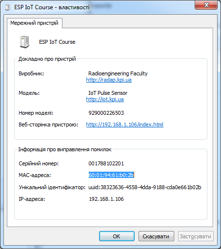

Урок 2. Лагодження програм та  налаштування Wi-Fi точки доступу
============

Зміст
-------

   * [Особливості відладки програм (Debugging)](#Особливості-відладки-програм-debugging)
      * [Вимоги для можливості відладки](#Вимоги-для-можливості-відладки)
      * [Послідовність налаштування відладки](#Послідовність-налаштування-відладки)
      * [Приклад налаштування власних повідомлень відладчика](#Приклад-налаштування-власних-повідомлень-відладчика)
      * [Дамп стеку](#Дамп-стеку)
   * [Робота ESP8266 з Wi-Fi мережами](Робота-esp8266-з-wi-fi-мережами) 
      * [Налаштування Wi-Fi точки доступу](#Налаштування-wi-fi-точки-доступу)
      * [Налаштування WEB сервера на ESP8266](#Налаштування-web-сервера-на-esp8266)  
      * [SSDP автовідповідач (ESP8266SSDP)](#SSDP-автовідповідач-(ESP8266SSDP))
      * [Віддалене керування портами вводу-виводу через Wi-Fi точку доступу](Віддалене-керування-портами-вводу-виводу-через-wi-fi-точку-доступу) 
   * [Завдання](#tests)
   * [Перелік посилань](#Перелік-посилань)

***


# Особливості відладки програм (Debugging)

З версії `2.1.0-rc1` в `Arduino IDE` з'явилася функція відладки, яка управляється над меню `IDE`. В цьому меню можливо налаштувати повідомлення, що з'являються в режимі реального часу.

### Вимоги для можливості відладки

Для використання відладки необхідно обрати один з послідовних інтерфейсів `UART` (`Serial` або `Serial1`). Для цього послідовний іннтерфейс в `setup()` слід налаштувати з максимальною швидкістю.

```c
void setup() {
    Serial.begin(115200);
}

void loop() {

}
```

### Послідовність налаштування відладки
 
1.	Виберіть послідовний інтерфейс для повідомлень відладчика.
 

2.	Зробіть вибір типу / рівня налагоджувальних повідомлення.
  

3.	Перевірте, чи інтерфейс послідовного інтерфейсу ініціалізованого в `setup()`. 

4.	Запрограмуйте скетч.

5.	Перевірте термінал послідовнго інтерфейсу.

> Вибір послідовного інтерфейсу для виводу повімлень відладчика не виключає можливості його використання у самій програмі для власних цілей.


Для можливості використання відладки використовуються додаткові визначення (`defines`), що задаються командним рядком. Наприклад,  визначення порта має значення `DEBUG_ESP_PORT`, яке можна визначити: 
- Disabled: визначеня не виконано 
- Serial: Serial 
- Serial1: Serial1

Всі визначення для різних рівнів починаються з `DEBUG_ESP_`, повний список яких можна знайти у файлі [boards.txt](https://github.com/esp8266/Arduino/blob/master/boards.txt#L180).

### Приклад налаштування власних повідомлень відладчика

Налагоджувальні повідомлення будуть відображатися тільки у разі вибору відповідного порта для відладки в меню `IDE`.

```c
#ifdef DEBUG_ESP_PORT
#define DEBUG_MSG(...) DEBUG_ESP_PORT.printf( __VA_ARGS__ )
#else
#define DEBUG_MSG(...)
#endif
 
void setup() {
    Serial.begin(115200);
 
    delay(3000);
    DEBUG_MSG("bootup...\n");
}
 
void loop() {
    DEBUG_MSG("loop %d\n", millis());
    delay(1000);
}
```

### Дамп стеку

У разі якщо в ESP виникне збій, з'явиться повідомлення про виключення та буде переданий у термінал вміст стеку (дамп).

<details><summary>Детальніше</summary><p>
Приклад дампу стеку:  
 
    Exception (0): epc1=0x402103f4 epc2=0x00000000 epc3=0x00000000 excvaddr=0x00000000 depc=0x00000000
    
    ctx: sys
    sp: 3ffffc10 end: 3fffffb0 offset: 01a0
    
    >>>stack>>>
    3ffffdb0:  40223e00 3fff6f50 00000010 60000600
    3ffffdc0:  00000001 4021f774 3fffc250 4000050c
    3ffffdd0:  400043d5 00000030 00000016 ffffffff
    3ffffde0:  400044ab 3fffc718 3ffffed0 08000000
    3ffffdf0:  60000200 08000000 00000003 00000000
    3ffffe00:  0000ffff 00000001 04000002 003fd000
    3ffffe10:  3fff7188 000003fd 3fff2564 00000030
    3ffffe20:  40101709 00000008 00000008 00000020
    3ffffe30:  c1948db3 394c5e70 7f2060f2 c6ba0c87
    3ffffe40:  3fff7058 00000001 40238d41 3fff6ff0
    3ffffe50:  3fff6f50 00000010 60000600 00000020
    3ffffe60:  402301a8 3fff7098 3fff7014 40238c77
    3ffffe70:  4022fb6c 40230ebe 3fff1a5b 3fff6f00
    3ffffe80:  3ffffec8 00000010 40231061 3fff0f90
    3ffffe90:  3fff6848 3ffed0c0 60000600 3fff6ae0
    3ffffea0:  3fff0f90 3fff0f90 3fff6848 3fff6d40
    3ffffeb0:  3fff28e8 40101233 d634fe1a fffeffff
    3ffffec0:  00000001 00000000 4022d5d6 3fff6848
    3ffffed0:  00000002 4000410f 3fff2394 3fff6848
    3ffffee0:  3fffc718 40004a3c 000003fd 3fff7188
    3ffffef0:  3fffc718 40101510 00000378 3fff1a5b
    3fffff00:  000003fd 4021d2e7 00000378 000003ff
    3fffff10:  00001000 4021d37d 3fff2564 000003ff
    3fffff20:  000003fd 60000600 003fd000 3fff2564
    3fffff30:  ffffff00 55aa55aa 00000312 0000001c
    3fffff40:  0000001c 0000008a 0000006d 000003ff
    3fffff50:  4021d224 3ffecf90 00000000 3ffed0c0
    3fffff60:  00000001 4021c2e9 00000003 3fff1238
    3fffff70:  4021c071 3ffecf84 3ffecf30 0026a2b0
    3fffff80:  4021c0b6 3fffdab0 00000000 3fffdcb0
    3fffff90:  3ffecf40 3fffdab0 00000000 3fffdcc0
    3fffffa0:  40000f49 40000f49 3fffdab0 40000f49
    <<<stack<<<
    

Перше число після Exception надає інформацію про причину скидання. Повний перелік можливих причин збою можна знайти за адресою: http://arduino-esp8266.readthedocs.io/en/2.4.0/exception_causes.html, шіснадцяткові коди, що навендені вище, є вмістом стеку.
    
Decode
It’s possible to decode the Stack to readable information. For more info see the Esp Exception Decoder tool.

Длоя того, щоб декодувати вміст стеку необхідно використовувати інструмент [`Esp Exception Decoder tool`](https://github.com/me-no-dev/EspExceptionDecoder).

  
</p></details>


# Робота ESP8266 з Wi-Fi мережами

### Налаштування Wi-Fi точки доступу


```c
#include <ESP8266WiFi.h>        // Бібліотека для роботи з Wi-Fi мережами
IPAddress apIP(192, 168, 4, 1); // IP адреса точки доступа на ESP

String ssid        = "RTFnet"; // SSID для підключення до Wi-Fi мережі
String password    = ""; // Пароль до мережі
String ssidAP      = "ESP_IoT";   // SSID AP точки доступа
String passwAP     = ""; // пароль точки доступа

void setup() {
  Serial.begin(115200);
  Serial.println("");
  Serial.println("Start 1-WIFI");
  //Запуск WIFI
  WIFIinit();
}

void loop() {
  delay(1);
}

void WIFIinit() {
  // Спроба приєднатися до Wi-Fi мережі
  WiFi.mode(WIFI_STA);
  byte tries = 11; // К-ть спроб
  WiFi.begin(ssid.c_str(), password.c_str());
  while (--tries && WiFi.status() != WL_CONNECTED)
  {
    Serial.print(".");
    delay(1000);
  }
  if (WiFi.status() != WL_CONNECTED)
  {
    // У разі, якщо приєднатися до мережі не вдається запускаемо ESP в режимеі Access Point
    Serial.println("");
    Serial.println("WiFi up AP");
    StartAPMode();
  }
  else {
    Serial.println("");
    Serial.println("WiFi connected");
    Serial.println("IP address: ");
    Serial.println(WiFi.localIP());
  }
}

bool StartAPMode()
{
  WiFi.disconnect();
  WiFi.mode(WIFI_AP);
  WiFi.softAPConfig(apIP, apIP, IPAddress(255, 255, 255, 0));
  WiFi.softAP(ssidAP.c_str(), passwAP.c_str());
  return true;
}
```

### Налаштування WEB сервера на ESP8266


### SSDP автовідповідач (ESP8266SSDP)

`SSDP` - це ще один протокол виявлення сервісів, який підтримується на Windows із коробки. 

Приклад для перевірки.

``` c
#include <ESP8266WiFi.h>
#include <ESP8266WebServer.h>
#include <ESP8266SSDP.h>

const char* ssid = "************"; //вкажіть власний ssid Wi-Fi мережі
const char* password = "***********"; //вкажіть пароль до Wi-Fi мережі

ESP8266WebServer HTTP(80);

void setup() {
  Serial.begin(115200);
  Serial.println();
  Serial.println("Starting WiFi...");

  WiFi.mode(WIFI_STA);
  WiFi.begin(ssid, password);
  if(WiFi.waitForConnectResult() == WL_CONNECTED){

    Serial.printf("Starting HTTP...\n");
    HTTP.on("/index.html", HTTP_GET, [](){
      HTTP.send(200, "text/plain", "Hello World! You are trying make examples from Module 2  in ESP IoT Course");
    });
    HTTP.on("/description.xml", HTTP_GET, [](){
      SSDP.schema(HTTP.client());
    });
    HTTP.begin();

    Serial.printf("Starting SSDP...\n");
    SSDP.setDeviceType("upnp:rootdevice");
    SSDP.setSchemaURL("description.xml");
    SSDP.setHTTPPort(80);
    SSDP.setName("ESP IoT Course");
    SSDP.setSerialNumber("001788102201");
    SSDP.setURL("index.html");
    SSDP.setModelName("IoT Pulse Sensor");
    SSDP.setModelNumber("M518");
    SSDP.setModelURL("http://iot.kpi.ua");
    SSDP.setManufacturer("Radioengineering Faculty");
    SSDP.setManufacturerURL("http://radap.kpi.ua);
    SSDP.begin();

    Serial.printf("Ready!\n");
  } else {
    Serial.printf("WiFi Failed\n");
    while(1) delay(100);
  }
}

void loop() {
  HTTP.handleClient();
  delay(1);
}
```





 


### Віддалене керування портами вводу-виводу через Wi-Fi точку доступу


```c
#include <ESP8266WiFi.h>
#include <WiFiClient.h> 
#include <ESP8266WebServer.h>

/* Set these to your desired credentials. */
const char *ssid = "Microcloud_2";
const char *password = "654321";

ESP8266WebServer server(80);

const int led = 2;  //GPIO2

/* Just a little test message.  Go to http://192.168.4.1 in a web browser
 * connected to this access point to see it.
 */
void handleRoot() {

  int size=1000;
  char temp[size];
  
  int sec = millis() / 1000;
  int min = sec / 60;
  int hr = min / 60;

  snprintf ( temp, size,

"<html>\
  <head>\    
    <title>MicroCloud</title>\
    <style>\
      body { background-color: #cccccc; font-family: Arial, Helvetica, Sans-Serif; Color: #000088; }\
    </style>\
  </head>\
  <body>\
    <h3>You are connected on MicroCloud #2!</h3>\
    <p>Uptime: %02d:%02d:%02d</p>\    
    <p>Status: Light ON</h1></p>\
    <p><a href=\"http://192.168.4.1/on\"><h1>Turn ON</h1></a></p>\
    <p></p>\
    <p><a href=\"http://192.168.4.1/off\"><h1>Turn OFF</h1></a></p>\           
  </body>\
</html>",

    hr, min % 60, sec % 60
  );
  server.send ( 200, "text/html", temp );  
  
}

void setup() {
	delay(1000);
	Serial.begin(9600);
	Serial.println();
	Serial.print("Configuring access point...");

	/* You can remove the password parameter if you want the AP to be open. */
	WiFi.softAP(ssid, password);

	IPAddress myIP = WiFi.softAPIP();
	Serial.print("AP IP address: ");
	Serial.println(myIP);

  pinMode(led, OUTPUT);
  digitalWrite ( led, HIGH );

  //URLs available to query
	server.on("/", handleRoot);
  server.on ( "/on", turnON );    
  server.on ( "/off", turnOFF );
	server.begin();
	Serial.println("HTTP server started");
  
}

void turnON(){

  digitalWrite ( led, HIGH );

  int size=1000;
  char temp[size];

  int sec = millis() / 1000;
  int min = sec / 60;
  int hr = min / 60;

  snprintf ( temp, size,

"<html>\
  <head>\    
    <title>MicroCloud</title>\
    <style>\
      body { background-color: #cccccc; font-family: Arial, Helvetica, Sans-Serif; Color: #000088; }\
    </style>\
  </head>\
  <body>\
    <h3>Request: Light ON</h3>\
    <p>Uptime: %02d:%02d:%02d</p>\
    <p></p>\
    <p>Status: Light ON</h1></p>\
    <p><a href=\"http://192.168.4.1/on\"><h1>Turn ON</h1></a></p>\
    <p></p>\
    <p><a href=\"http://192.168.4.1/off\"><h1>Turn OFF</h1></a></p>\       
  </body>\
</html>",

    hr, min % 60, sec % 60
  );

  server.send ( 200, "text/html", temp);
  
}

void turnOFF(){

  digitalWrite ( led, LOW );

  int size=1000;
  char temp[size];

  int sec = millis() / 1000;
  int min = sec / 60;
  int hr = min / 60;

  snprintf ( temp, size,

"<html>\
  <head>\    
    <title>MicroCloud</title>\
    <style>\
      body { background-color: #cccccc; font-family: Arial, Helvetica, Sans-Serif; Color: #000088; }\
    </style>\
  </head>\
  <body>\
    <h3>Request: Light OFF</h3>\
    <p>Uptime: %02d:%02d:%02d</p>\
    <p>Status: Light OFF</p>\
    <p><a href=\"http://192.168.4.1/on\"><h1>Turn ON</h1></a></p>\
    <p></p>\
    <p><a href=\"http://192.168.4.1/off\"><h1>Turn OFF</h1></a></p>\       
  </body>\
</html>",

    hr, min % 60, sec % 60
  );

  server.send ( 200, "text/html", temp);
  
}

void loop() {
	server.handleClient();
}
```

[//]: ## "Завдання" 

Перелік посилань:	
---
1. http://arduino-esp8266.readthedocs.io/en/latest/
1. https://github.com/esp8266/Arduino
1. https://create.arduino.cc/projecthub/luciorocha/esp8266-control-led-with-smartphone-8a59f3
1. http://esp8266-arduinoide.ru/step1-wifi/


