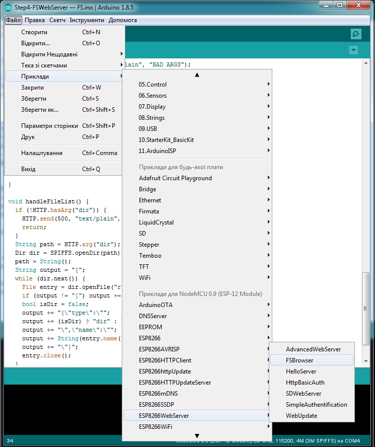

Урок 3. Стандартні бібліотеки та API для ESP8266
=================

<!--ts-->
   * [Робота з бібліотеками `ESP8266`](#Робота-з-бібліотеками-esp8266)
      * [Функції формування часових затримок та подій](#Функції-формування-часових-затримок-та-подій)
      * [Бібліотека "Ticker". Формування періодичних подій за перериваннями від таймера](#Бібліотека-ticker-Формування-періодичних-подій-за-перериваннями-від-таймера)
   * [Створення файлової системи на `ESP8266`](#Створення-файлової-системи-на-esp8266)
<!--te-->


# Робота з бібліотеками `ESP8266`


### Функції формування часових затримок
    
Функції `millis()` і `micros()` повертають кількість мілісекунд і мікросекунд, що минули після скидання (`RESET`).
    
Функція `delay(ms)` призупиняє роботу основної програми на заданий час в мілісекундах і резервує цей час для обробки завдань `Wi-Fi` та `TCP/IP`. 

Функція `delayMicroseconds(us)` призначена для паузи на задане число мікросекунд.
    
> Пам'ятайте, що для стабільної роботи `Wi-Fi` потрібно періодично виділяти для нього час. Функції з бібліотек `Wi-Fi` і `TCP/IP`  отримують можливість обробляти свої події щоразу після проходження функції `loop()` або у разі виклику функції `delay`. 
    
Якщо алгоритм оброблення в `Loop()` займає час більше ніж 50 мс, то слід подбати про виклик `delay(0)` саме для підтримки нормальної роботи `Wi-Fi`. Для цього також можливо використовувати функцію `yield()`, яка є еквівалентною `delay(0)`. 

> Функція  `delayMicroseconds()` не поступається часом виконання іншим завданням, тому використання її для затримки більш ніж на 20 мілісекунд не рекомендується.


### Бібліотека "Ticker". Формування періодичних подій за перериваннями від таймера

Ця бібліотека призначена для програмного переривання за таймером. 

Щоб підключити переривання, для початку треба підключити бібліотеку :
```c
#include <Ticker.h>
```

Далі створюємо один або декілька екземплярів переривань, залежно від потреби:
```c
Ticker name, name2;
```

Для створених екземплярів `name` та `name2` ми можемо налаштувати переривання, що будуть формуватися з заданою періодичністю. 

Налаштування періодичності можливо здійснити за допомогою функцій `attach` та `attach_ms` з параметрами для визначення періоду в секундах (`seconds`) або ()мілісекундах `miliseconds`)  та функції `callback`, що має бути викликана щоразу при виникнені переривання.

``` c
name.attach(seconds, callback);
name2.attach_ms(miliseconds, callback2);
```

До функції `callback` також можливо додати аргументи `arg`:

``` c
name.attach(seconds, callback, arg);
name2.attach_ms(miliseconds, callback, arg);
```


Отже `callback` - це ім’я функції, що буде викликатися щоразу при перериванні, а її аргумент `arg` може бути лише один. 

Для налаштування формування переривання лише раз треба використовувати функції, що дуже подібні до попередніх:

``` c
name.once(seconds, callback);
name.once(seconds, callback, arg);
name.once_ms(miliseconds, callback);
name.once_ms(miliseconds, callback, arg);
```

Існує ще дві не менш важливі функції  – `detach`, що відключає переривання та `active`, що повертає стан переривання у форматі `bool`.
``` c
name.detach();
bool check = name.active();
```


> Також існує бібліотека [TickerScheduler](https://github.com/Toshik/TickerScheduler), що базується на `Ticker` і дозволяє працювати з `Task` та допомагає уникнути проблем з сторожовим таймером `WDT`. 

Приклад №1:

```c
#include <Ticker.h> // Підключення бібліотеки

Ticker flipper; // Cтворення екземпляру flipper

int count = 0; // Створення зміної лічби

void flip()
{
  int state = digitalRead(D4);  // отримати поточний стан піну D4
  digitalWrite(D4, !state);     // встановлення піна у протилежний стан
  
  ++count; // (Інкремент) збільшення значення лічильника на +1 
  // коли лічильник досягає певної величини (20), LED починайте блимати, як божевільний
  if (count == 20)
  {
    flipper.attach(0.1, flip); // Переналаштовуємо переривання на виклик функції flip з періодом 0.1 секунди
  }
  // коли лічильник досягає величини (120), припиняє блимати
  else if (count == 120)
  {
    flipper.detach(); // Відключає переривання
  }
}

void setup() {
  pinMode(D4, OUTPUT); // Налаштування виводу D4   
  digitalWrite(D4, LOW); 
  
  // flip the pin every 0.3s
  flipper.attach(0.3, flip); // Підключаємо переривання на виклик функції flip з періодом 0.3 секунди
}

void loop() {
  // В основному циклі нічого не робимо
}
```

Приклад №2:

```c
#include <Ticker.h> // Підключення бібліотеки

Ticker tickerSetHigh; // Створення екземпляру tickerSetHigh
Ticker tickerSetLow; // Створення екземпляру tickerSetLow

void setPin(int state) {
  digitalWrite(D4, state); // встановлення піна у стан - state
}

void setup() {
  pinMode(D4, OUTPUT); // Налаштування виводу D4  
  digitalWrite(D4, LOW);
  
  // кожні 25 мс, викликає setPin(0)
  tickerSetLow.attach_ms(25, setPin, 0);
  
  // кожні 26 мс, викликає setPin(1)
  tickerSetHigh.attach_ms(26, setPin, 1);
}

void loop() {
  // В основному циклі нічого не робимо
}
```

## Спеціальні функції та команди для ESP8266

Спеціальні функції ESP пов'язані з режимом глибокого сну, RTC (точного часу) і флеш-пам'яті. Дані функції доступні в об'єкті – `ESP`. 

Так, наприклад, функція `ESP.deepSleep(microseconds, mode)` переводить модуль в режим глибокого сну. Параметр mode може приймати значення: 
* `WAKE_RF_DEFAULT`,  
* `WAKE_RFCAL`,  
* `WAKE_NO_RFCAL`,  
* `WAKE_RF_DISABLED`. 

Для виходу з режиму глибокого сну, треба з'єднати GPIO16 з RESET.

Функції `ESP.rtcUserMemoryWrite(offset, & data, sizeof (data))` та `ESP.rtcUserMemoryRead(offset, & data, sizeof (data))` дозволяють записувати та зчитувати дані з пам'яті `RTC`. Загальний розмір пам'яті `RTC` складає 512 байт, тому `offset + sizeof(data)` не повинні перевищувати 512. Змінна – `data` повинна бути рівна 4-м байтам. Збережені дані можуть зберігатися між циклами глибокого сну. 

> Інформація в `RTC` втрачається після вимикання живлення.


<details><summary>Приклад роботи з пам'ятю RTC</summary><p>


```c
// Структурні дані з максимальним розміром 512 байтів можуть зберігатися в 
// rtcDataory користувача RTC за допомогою інтерфейсів ESP-specific.
// Збережені дані можна зберігати між циклами глибокого сну.
// Однак ці дані можуть бути втрачені після скидання живлення на ESP8266.
//
// Цей приклад використовує режим глибокого сну, тому перед тим, як запустити його, 
// підключіть контакти GPIO16 та RST.


// Функція CRC використовується для забезпечення достовірності даних
uint32_t calculateCRC32(const uint8_t *data, size_t length);
// Таке об'явлення функції називається прототипом. Без її тіла дозволяє викликати її до її об'яви, 
                                                   // що виконана нижче (така об'ява

// допоміжна функція, щоб надрукувати вміст пам'яті у шістнадцятковому вигляді
void printMemory();

// Структура, яка буде зберігатися в пам'яті RTC.
// Перше поле crc32, що розраховується на основі решти вмісту структури.
// Будь-які поля можуть йти після CRC32.
// Ми використовуємо байтовий масив як приклад.
struct {
  uint32_t crc32;
  byte data[508];
} rtcData;

void setup() {
  Serial.begin(115200);
  Serial.println();
  delay(1000);

  // Зчитування структури з пам'яті RTC
  if (ESP.rtcUserMemoryRead(0, (uint32_t*) &rtcData, sizeof(rtcData))) {
    Serial.println("Read: ");
    printMemory();
    Serial.println();
    // обчислимо значення crc32 на основі зчитаних даних
    uint32_t crcOfData = calculateCRC32( (uint8_t*) &rtcData.data[0], sizeof(rtcData.data) );
    Serial.print("CRC32 of data: ");
    Serial.println(crcOfData, HEX);
    Serial.print("CRC32 read from RTC: ");
    Serial.println(rtcData.crc32, HEX);
    if (crcOfData != rtcData.crc32) { 
      Serial.println("CRC32 in RTC memory doesn't match CRC32 of data. Data is probably invalid!");
    }
    else {
      Serial.println("CRC32 check ok, data is probably valid.");
    }
  }

  // Генерування нових даних для структури
  for (size_t i = 0; i < sizeof(rtcData.data); i++) {
    rtcData.data[i] = random(0, 128); // випадковим чином
  }
  // Оновлення CRC32 для нових даних
  rtcData.crc32 = calculateCRC32( (uint8_t*) &rtcData.data[0], sizeof(rtcData.data) );
  // Запис нашої структури в пам'ять RTC
  if (ESP.rtcUserMemoryWrite(0, (uint32_t*) &rtcData, sizeof(rtcData))) {
    Serial.println("Write: ");
    printMemory();
    Serial.println();
  }

  Serial.println("Going into deep sleep for 5 seconds");
  ESP.deepSleep(5e6); // Лягамо поспати на 5 секунд для економії енергії
}

void loop() {
  // В основному циклі нічого не робимо
}

// Обережно математика для програмістів ;) 
uint32_t calculateCRC32(const uint8_t *data, size_t length)
{
  uint32_t crc = 0xffffffff; // заповнення одиницями всіх 32-х бітів
  while (length--) {
    uint8_t c = *data++; // тут хитрий обхід масиву даних
    for (uint32_t i = 0x80; i > 0; i >>= 1) { // (i >>= 1) - зсув на 1 біт в право з присвоєням кінечного результату, що еквівалентно i = i / 2
      bool bit = crc & 0x80000000; // виділення першого біту за допомогою маски 0x80000000 та побітового перемноження
      if (c & i) { // аналогічна операція, лише роль маски грає змінна "i"
        bit = !bit; // інвертувати значення
      }
      crc <<= 1; // побітовий зсув на 1 вліво з присвоєням кінечного результату, що еквівалентно crc = crc * 2
      if (bit) { // якщо прапорець bit піднятий (має значення true = 1)
        crc ^= 0x04c11db7; // інвертувати значення вказані в масці (відкрийте калькулятор в режимі прорамування)
      }
    }
  }
  return crc; // повернення сформованої величини
}

// друкує всі дані rtcData, у тому числі провідний CRC32 заголовок
void printMemory() {
  char buf[3]; // створення буферу пам'яті на 3 символи (байти)
  uint8_t *ptr = (uint8_t *)&rtcData; // хитре перетворення типів даних
  for (size_t i = 0; i < sizeof(rtcData); i++) {
    sprintf(buf, "%02X", ptr[i]); // запис шіснадцяткового числа як 3 сивола в буфер, останій символ є символ завершення рядку '\0'
    Serial.print(buf); // вивід на екран вмісту буфера
    if ((i + 1) % 32 == 0) { // коли остача від (i+1) при ділені на 32 рівна 0, тобто коли заначення кратне 32
      Serial.println(); // перейти на новий рядок
    }
    else { // 
      Serial.print(" "); // відступити
    }
  }
  Serial.println();
}
```

</p></details>

### Сторожовий таймер WDT

Автоматизовані системи, що не контролюються постійно людиною, також схильні до помилок, зависань та інших збоїв (зокрема апаратних). Тому використання в них сторожових таймерів збільшують їхню стабільність роботи, завдяки встановлення часового обмеження на реакцію оновлення свого статусу. Якщо оновлення статусу не відбулося, то відбувається примусовий перезапуск системи.

Функції `ESP.wdtEnable()`, `ESP.wdtDisable()` і `ESP.wdtFeed()` керують сторожовим таймером.

Приклад:

```c
void setup() {

  ➥ якийсь код програми

  // По замовчуванню WDT вже ввімкнений, 
  // тому викликати wdtEnable() без налаштувань не має сенсу
  ESP.wdtEnable(6000); // Встановлення періоду скидання програми на 6 секунд
}

void loop() {
  
  ➥ якийсь код програми

  ESP.wdtFeed(); // Скидаємо таймер в 0, щоб наша програма не скинулася

  ➥ ще якийсь код програми

  ESP.wdtFeed(); // Скидаємо таймер в 0, щоб наша програма не скинулася

  ➥ і ще якийсь код програми

  ESP.wdtDisable(); // вимкнути WDT
  100% робочий але дуже потребуючий алгоритм
  ESP.wdtEnable(); // увімкнути WDT

  ➥ можливо щось іще

}
```

Функція | Результат виконання
--- | --- 
`ESP.reset()` | Перезавантаження модуля
`ESP.getResetReason()` | Отримання інформації у форматі String про причину виникнення RESET.
`ESP.getFreeHeap()` | Визначити розмір вільної пам'яті
`ESP.getCoreVersion()`| Отримання інформації у форматі String з версіэю ядра процесора.
`ESP.getSdkVersion()` | Отримання інформації про версію SDK у форматі char.
`ESP.getCpuFreqMHz()` | Отримання інформації про значення частоти процесора в МГц у форматі uint 8-bit.
`ESP.getSketchSize()` | Отримання інформації про розмір завантаженого в модуль скетчу у форматі uint 32-bit.
`ESP.getFreeSketchSpace()` | Отримання інформації про наявнеий вільний простір для скетчу у формматі uint 32-bit.
`ESP.getSketchMD5()` | MD5 хеш поточного скетчу.
`ESP.getChipId()` | Отримання інформації про Id чіпа ESP8266 у форматі int 32bit
`ESP.getFlashChipId()` | Отримання інформації про Id чіпа  flash пам'яті у форматі int 32bit
`ESP.getFlashChipSize()` | Отримання інформації про розмір flash пам'яті в байтах, так, як його визначає SDK (може бути менше реального розміру).
`ESP.getFlashChipRealSize()` | Отримання інформації про дійсний розмір чіпа flash пам'яті в байтах на основі flash chip ID.
`ESP.getFlashChipSpeed(void)` | Отримання інформації про  частоту флеш пам'яті, в Герцах.
`ESP.getCycleCount()` | Отримання інформації про  кількість циклів CPU з моменту старту у форматі unsigned 32-bit. Функція може бути корисна для формування точних затримок.
`ESP.getVcc()` |  Отримання інформації про значення напруги живлення (потребує додаткового налаштування під час ініціалізації мікроконтролера)

> Для роботи функції `ESP.getVcc()` ESP має переналаштувати АЦП під час запуску. Додайте наступний рядок у верхній частині скетча, щоб скористатися цією функцією:
>``` c
>ADC_MODE(ADC_VCC);
>```
>
>Пін A0 (АЦП) не повинен бути задіяний периферією в цьому режимі.
Зверніть увагу, що по замовчанню АЦП налаштовується для зчитування напруги за допомогою `analogRead(A0)` і функція `ESP.getVCC()` недоступна.


Приклад:

```c
ADC_MODE(ADC_VCC);

void setup() {
  // налаштуйте послідовний порт
}

void loop() {
  int getVcc = ESP.getVcc();
  // виведіть результат
  // переведіть результат в напругу і знову виведіть 
  // (треба поділити на 1024, або своє значення отримане пілся калібровки, 
  // і далі працювати з типом даних для дробних числ)
  // зробіть затримку
}
```

#Створення файлової системи на `ESP8266`


Для того, щоб розгорнути файлову систему на модулі `ESP8266` скористаємося прикладом, що наведений в бібліотеці `Wi-Fi` ( в меню  _Файл_ > _Приклади_ > _ESP8266WebServer _.).



Контeнт, який хочемо завантажити у файлову систему модуля необхідно розмістити у піддиректрії `data` відносно місця збереження скетча. Для завантаження даних до модуля слід використовувати  `MkSPIFFS Tool` ("ESP8266 Sketch Data Upload" в меню  `Інструменти` Arduino IDE).

##Arduino ESP8266 filesystem uploader

Для того, щоб в Arduino IDE з'явилась можливість завантажувати дані необхідно встановити плагін, який буде компілювати вміст директрії data в образ для файлової системи SPIFFS і завантажувати цей образ до flash пам'яті ESP8266.

###Встановлення

ESP8266FS є інструментом, який інтегрується в IDE Arduino. Він додає елемент до меню `Інструменти` для завантаження файлів, що містяться в каталозі скетчу, до файлової системи ESP8266.
*	Завантажте інструмент: https://github.com/esp8266/arduino-esp8266fs-plugin/releases/download/0.3.0/ESP8266FS-0.3.0.zip.
*	У каталозі Sketchbook Arduino створіть директорію tools (якщо вона ще не існує)
*	Розпакуйте інструмент у каталозі tools (шлях виглядатиме як <home_dir>/Arduino/tools/ESP8266FS/tool/esp8266fs.jar)
*	Перезавантаєте Arduino IDE
*	Відкрийте скетч (або створіть новий і збережіть його)
*	Перейдіть до каталогу програми (Ctrl+K)
*	Створіть там каталог з назвою data і додайте в нього будь-які файли, які вам треба помістити в файлову систему
*	Переконайтеся, що ви обрали плату, порт і закрили Serial Monitor
*	Виберіть Інструменти> ESP8266 Sketch Data Upload. Почнеться завантаження файлів у flash файлової системи ESP8266. Після завершення, інформаційна панель IDE повідомить про завантаження даних в SPIFFS.


> Перед тим як завантажувати дані впевніться в тому, що Ви правильно обрали плату та порт, а послідовний монітор є закритим.
    


<!--- КОМЕНТАР MarkDown

  ADC_MODE(ADC_VCC);

void setup() {
   Serial.begin(115200);
}

void loop() {
int vcc = ESP.getVcc();
Serial.println(vcc);
float vccVolt = ((float)ESP.getVcc())/1024;
Serial.println(vccVolt);
delay(1000);
}

КОМЕНТАР MarkDown 

Останій приклад `TestEspApi` знаходиться в меню _Файл_ > _Приклади_ > _ESP8266_.
-->

[//]: ## "Завдання" 

Перелік посилань:	
---
1. http://arduino-esp8266.readthedocs.io/en/latest/
1. https://github.com/esp8266/Arduino
1. https://uk.wikipedia.org/wiki/%D0%A1%D1%82%D0%BE%D1%80%D0%BE%D0%B6%D0%BE%D0%B2%D0%B8%D0%B9_%D1%82%D0%B0%D0%B9%D0%BC%D0%B5%D1%80
1. https://github.com/esp8266/arduino-esp8266fs-plugin


